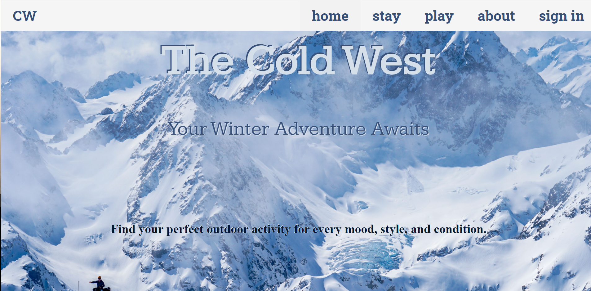
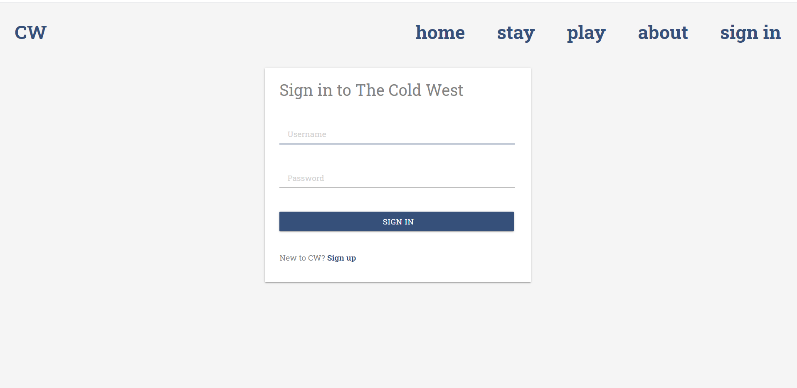
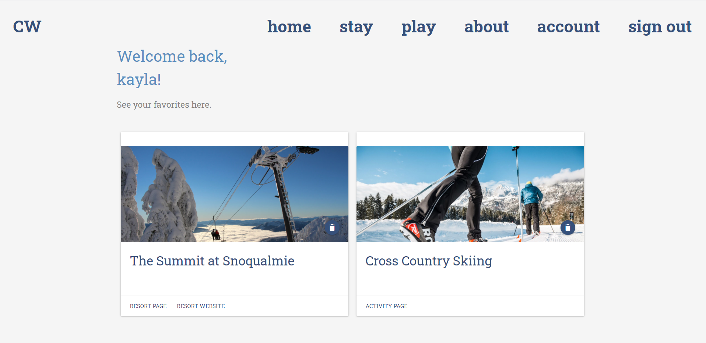

# The Cold West

Join The Cold West Tours this winter and find your perfect outdoor activity for every mood, style, and condition. Your adventure awaits. 

  
## Description 
We've pulled together all ten ski and snowboard resorts in Washington State. Start your winter sport planning here! Create an account with us to save your favorite winter activity and favorite lodge. On each resort page you will find a stunning gallery of the mystical powder at each slope. Farther down you'll find information such as an overview, map, certain policies to keep in mind and available activities. Each respective activity page includes more beautiful pictures of the action, a quick about blurb describing the activity and a beginner's guide to jumping in a new sport. We hope you like it!

## Table of Contents 
* [Installation](#Installation)
* [Usage](#Usage)
* [License](#License)
* [Contributing](#Contributing)
* [Technologies](#Technologies)
* [Visuals](#Visuals)
* [Links](#Links)
* [Questions](#Questions)

## Installation
Clone the repo to your desktop
 Run npm install to download the necessary dependencies
 Check the package.json to ensure the necessary dependencies are downloaded 
 Change the force:false in the server.js file to true. 
 Create the winter_activity_db using workbench
 Refresh your schema
 Change the force:true back to false
 Start the server using npm start or node server.js
 Enjoy

## Usage
Once you're on the homepage you will see the sticky navbar displaying on the top. 
 Create an account with us by clicking on sign in. 
 Here you can save your favorite resort and activity. 
 Select your favorites once you're signed in by clicking the star icon by the name of the resort or activity. 
 Delete your current favorites with the trash button on the left in the account dashboard. 
 View the resorts webpage for more information using the resort website link under the image. 
 Use this application for resort contact information, address, and current policies. 
 If you're new to the snow sport community, we've got you covered. 
 Check out the beginner's guide for each activity located on the activity pages. 
 View the demo below for more information. 

## License
Copyright (c) The Cold West (MIT License)

## Contributing 
Thank you [Slick](https://kenwheeler.github.io/slick/) for helping us display our resort images.  

## Technologies
* [Materialize](https://materializecss.com/)
* [Slick](https://kenwheeler.github.io/slick/) 
* [Leaflet](https://leafletjs.com/)
* [MySql2](https://www.npmjs.com/package/mysql2)
* [Express](https://expressjs.com/)
* [Express-Handlebars](https://www.npmjs.com/package/express-handlebars)
* [Express-session](https://www.npmjs.com/package/express-session)
* [bcrypt](https://www.npmjs.com/package/bcrypt)
* [dotenv](https://www.npmjs.com/package/dotenv)
* [Sequelize](https://sequelize.org/)

## Visuals
Screenshot of homepage
Screenshot of user sign in page
Screenshot of user favorites dashboard

## Links
 [To Repo:](https://github.com/kbnewlon/Cold-West-Tours)
 [To Demo:](https://drive.google.com/file/d/1dSETviEwiEii2JRWHCnEuqlWr9bY95jU/view)  
 [To deployed application:](https://the-cold-west.herokuapp.com/)

## Questions 
Please contact our team if you have any questions:
 Github: Email 

 [Devin Gillogly](https://github.com/virlym) : virlym@gmail.com
 [Scott Dancer](https://github.com/ScottDancer) : scottpdancer@gmail.com
 [Chris MacGeorge](https://github.com/cmacgeorge1) : christopher.s.macgeorge@gmail.com
 [Zhuoyi Wang](https://github.com/zhouyiartemiswang) : wzyzhouyi@gmail.com
 [Kayla Newlon](https://github.com/kbnewlon) : kayla.b.newlon@gmail.com
